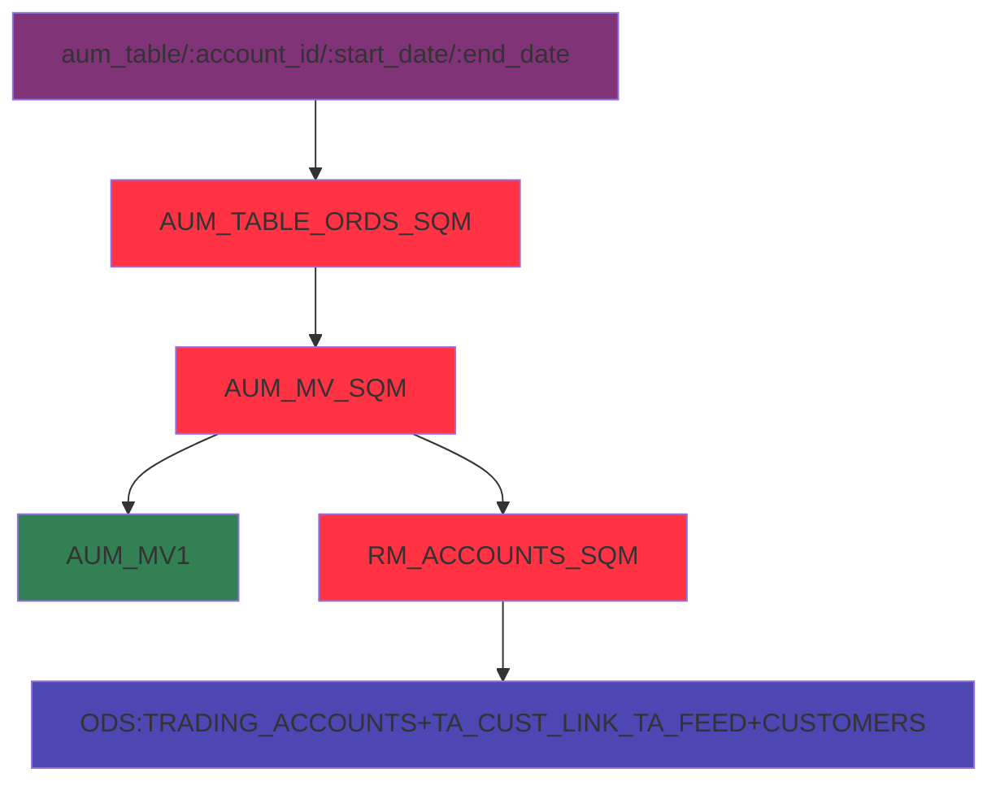

# testrepo
test repo

```mermaid
graph TD
    classDef sql_macro fill:#f34
    classDef mview fill:#338055
    classDef table fill:#4d47b3
    classDef ords fill:#803377
    ords["aum_table/:account_id/:start_date/:end_date"]:::ords --> AUM_TABLE_ORDS_SQM:::sql_macro
    AUM_TABLE_ORDS_SQM --> AUM_MV_SQM:::sql_macro
    AUM_MV_SQM --> AUM_MV1:::mview
    AUM_MV_SQM --> RM_ACCOUNTS_SQM:::sql_macro
    RM_ACCOUNTS_SQM --> tabs["ODS:TRADING_ACCOUNTS+TA_CUST_LINK_TA_FEED+CUSTOMERS"]:::table
```
