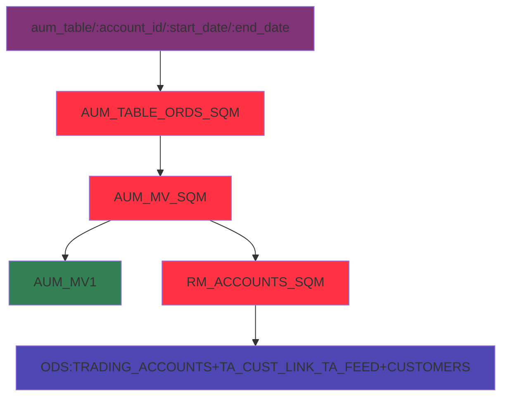
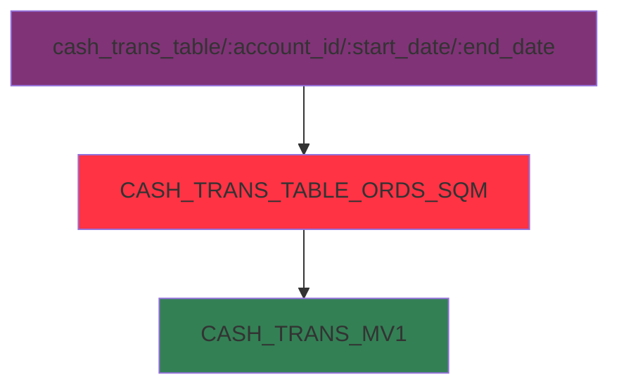
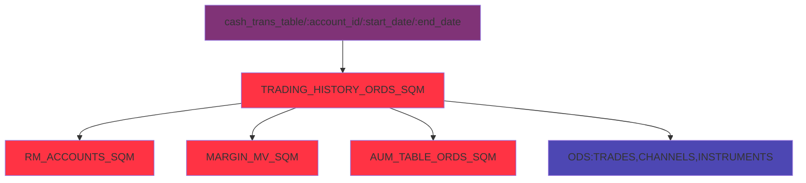

# testrepo

## Legend

```mermaid
graph TD
    classDef sql_macro fill:#f34
    classDef mview fill:#338055
    classDef table fill:#4d47b3
    classDef ords fill:#803377
    ords["ORDS Pattern"]:::ords
    sqlm["SQL Macro"]:::sql_macro
    mview["Mat View"]:::mview
    table["Table"]:::table
```

## AUM Table

```mermaid
graph TD
    classDef sql_macro fill:#f34
    classDef mview fill:#338055
    classDef table fill:#4d47b3
    classDef ords fill:#803377
    ords["aum_table/:account_id/:start_date/:end_date"]:::ords --> AUM_TABLE_ORDS_SQM:::sql_macro
    AUM_TABLE_ORDS_SQM --> AUM_MV_SQM:::sql_macro
    AUM_MV_SQM --> AUM_MV1:::mview
    AUM_MV_SQM --> RM_ACCOUNTS_SQM:::sql_macro
    RM_ACCOUNTS_SQM --> tabs["ODS:TRADING_ACCOUNTS+TA_CUST_LINK_TA_FEED+CUSTOMERS"]:::table
    click AUM_TABLE_ORDS_SQM "https://github.com/cmctechnology/alpha-data/blob/master/sql_macros/aum_table_ords_sqm.sql"
    click AUM_MV_SQM "https://github.com/cmctechnology/alpha-data/blob/master/sql_macros/aum_mv_sqm.sql"
    click AUM_MV1 "https://github.com/cmctechnology/alpha-data/tree/master/mviews/AUM_MV1"
    click RM_ACCOUNTS_SQM "https://github.com/cmctechnology/alpha-data/blob/master/sql_macros/rm_accounts_sqm.sql"
```

## Cash Trans Table

```mermaid
graph TD
    classDef sql_macro fill:#f34
    classDef mview fill:#338055
    classDef table fill:#4d47b3
    classDef ords fill:#803377
    ords["cash_trans_table/:account_id/:start_date/:end_date"]:::ords --> CASH_TRANS_TABLE_ORDS_SQM:::sql_macro
    CASH_TRANS_TABLE_ORDS_SQM --> CASH_TRANS_MV1:::mview
    click CASH_TRANS_TABLE_ORDS_SQM "https://github.com/cmctechnology/alpha-data/blob/master/sql_macros/cash_trans_table_ords_sqm.sql"
    click CASH_TRANS_MV1 "https://github.com/cmctechnology/alpha-data/tree/master/mviews/CASH_TRANS_MV1"
```

## Trading History

```mermaid
graph TD
    classDef sql_macro fill:#f34
    classDef mview fill:#338055
    classDef table fill:#4d47b3
    classDef ords fill:#803377
    ords["cash_trans_table/:account_id/:start_date/:end_date"]:::ords --> TRADING_HISTORY_ORDS_SQM:::sql_macro
    TRADING_HISTORY_ORDS_SQM --> RM_ACCOUNTS_SQM:::sql_macro
    TRADING_HISTORY_ORDS_SQM --> MARGIN_MV_SQM:::sql_macro
    TRADING_HISTORY_ORDS_SQM --> AUM_TABLE_ORDS_SQM:::sql_macro
    TRADING_HISTORY_ORDS_SQM --> tabs["ODS:TRADES,CHANNELS,INSTRUMENTS"]:::table
    
    click TRADING_HISTORY_ORDS_SQM "https://github.com/cmctechnology/alpha-data/blob/master/sql_macros/trading_history_ords_sqm.sql"
    click CASH_TRANS_MV1 "https://github.com/cmctechnology/alpha-data/tree/master/mviews/CASH_TRANS_MV1"
    click RM_ACCOUNTS_SQM "https://github.com/cmctechnology/alpha-data/blob/master/sql_macros/rm_accounts_sqm.sql"
    click MARGIN_MV_SQM "https://github.com/cmctechnology/alpha-data/blob/master/sql_macros/margin_mv_sqm.sql"
    click AUM_TABLE_ORDS_SQM "https://github.com/cmctechnology/alpha-data/blob/master/sql_macros/aum_table_ords_sqm.sql"
```

